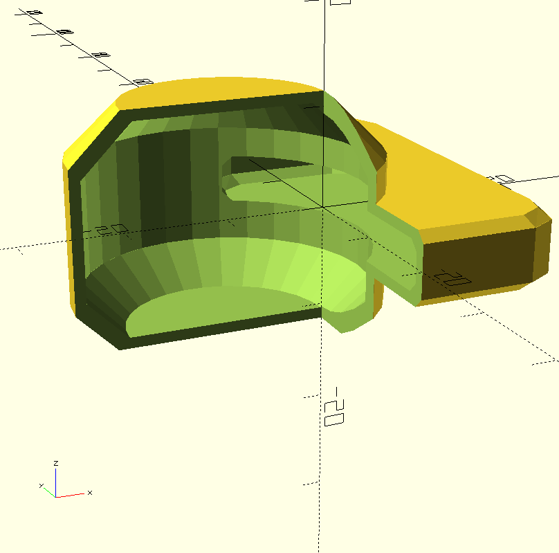
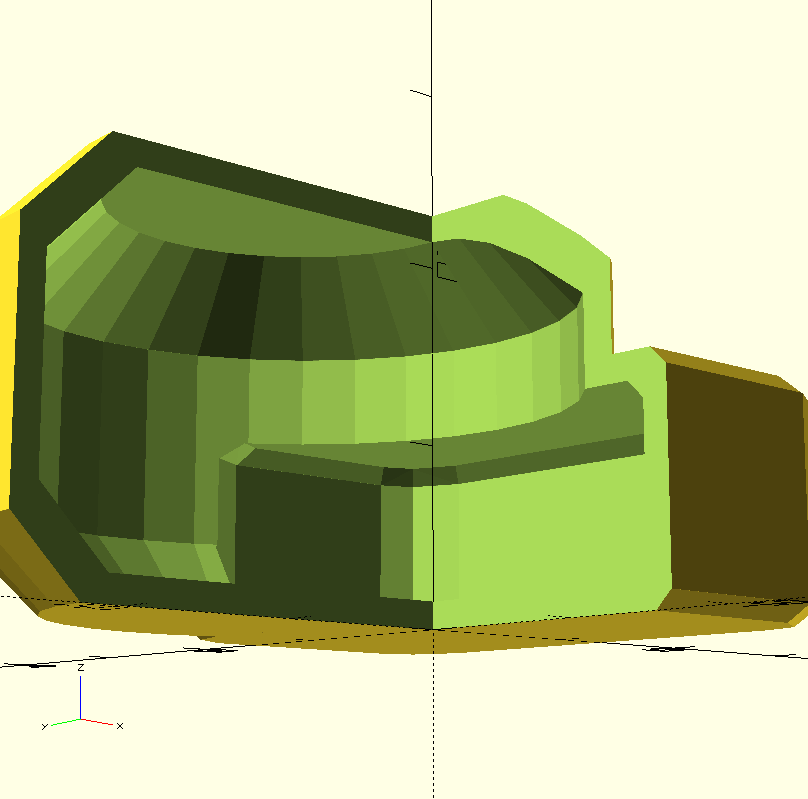

# Introduction to Openscad with the <u>Constructive</u> library for a new openscad user

### PART III

NOTE: THIS PART OF THE TUTORIAL IS STILL UNDER CONSTRUCTION.
THE FUNCTIONALITY IS IN THE LIBRARY IS READY AND BEING USED BUT THE TUTORIAL IS NOT COMPETE.
The Source code in 
https://github.com/solidboredom/constructive/blob/main/examples/mount-demo.scad
and 
https://github.com/solidboredom/constructive/blob/main/examples/pulley-demo.scad
might give some idea on parts missing here.

[Part III tutorial](./tutorial-partIII.md) shows advanced Features like grouping commands into a g() group, working with Parts, and combining them into Assembly
--------------------

If you are unsure about particular basic commands used in the codes snippets below, please refer to the [basic tutorial](./basic-tutorial.md).

See also:

[Part II tutorial](./tutorial-partII.md) shows some basic object modification like reflectX(), cScale(), or colors and then goes on to explain, how to work with sets of similar objects without for(), with: pieces(), span(), vals(), selectPieces(), etc..

For a more advanced use also look at the explanations inside the example below

https://github.com/solidboredom/constructive/blob/main/examples/mount-demo.scad

There is also another Example at:

https://github.com/solidboredom/constructive/blob/main/examples/pulley-demo.scad

> Note: Here A Gallery where some shiny constructive examples will be added, 
> to show what can be achieved

https://github.com/solidboredom/constructive/blob/main/gallery/

> Note: see here the source code of the Gallery pieces here:
> https://github.com/solidboredom/constructive/blob/main/gallery/sources/

Now little code is actually needed for this,
the code is in part not commented nor cleaned up, but it still can be used for reference

-------------------

The easiest way to try out the Library is to download the [kickstart.zip](https://github.com/solidboredom/constructive/blob/main/kickstart.zip)

> NOTE: To run all code examples from this tutorial you will need only Openscad and
> a single file: constructive-compiled.scad put it into OpenScad Library folder (File -> Show Library Folder...) OR at the same Folder as your own .scad files.
> the easiest way to start is to download the [kickstart.zip](https://github.com/solidboredom/constructive/blob/main/kickstart.zip)
> and then extract both files contained in it into same folder. Then you can open the tryExamples.scad from this folder with OpenScad, and then use this file to try the code Examples from the Tutorial, or anything else you like. Just Pressing F5 in Openscad to see the Results.

### g() groups several commands and parameters into single command,

Most of Constructive commands can be used inside and outside of g() providing exactly the same result, So in most cases usage of g() is not essential but is preferred. It generally reduces model compilation time by Openscad and allows you to specify additional default values like height(x) and solid() for a code block,
for example:

```.scad
include <constructive-compiled.scad>

two()
  g( reflectZ(sides()), Z(10) ,TOUP()
    , height(7), solid(true) )
  {
    tube(d=20);
    g(turnXY(45), X(60)) box(20);
  }  
```

  

#### height(h) and solid(true/false)

Specify the default value for Constructive primitive tube() and box(). (solid() only affects tube(), tubFast(), and  tubeShell() not the box()). So inside of the g() block above, the h and solid arguments can be omitted when using box() or tube().

------------------------------------------------

## assembling mechanical Parts from several Modules

#### assemble()

Allows application of universal operations like adding and removing solids (i.e. bring holes or adding screws), only to a Part of the Model representing a specific mechanical (sub-Part).

To start with, surrounding your code by an `assemble()` block without any parameters simply allows you to use add() and remove() instead of Openscads native difference().
One of the advantages over difference() is that you can put positive parts(to be subtracted from) and negative parts(to be subtracted) in any order at any place of the block in any number, even inside movements and rotations.
Whereas with difference() you are forced to start with a single positive part (or you have to use a union() of several) and continue by negative parts which will be subtracted, forcing this order on you.

For Example:

```.scad
include <constructive-compiled.scad>

assemble()
{
  g(X(10),turnXY(45),solid())
  {
    remove()
      box(15,h=10);
    add()
      tube(d=10,h=20);
  }

  add()Z(-3)
    box(10,h=10);
}
```

  

Similar to g() command it is preferred to group.
The preceding and following movement and rotation commands inside the according add statements() brackets.

So that:

```.scad
include <constructive-compiled.scad>

assemble()
{
  Z(10) turnXY(45) TOUP() add() g(height(10)) X(20) box(30);
}
```

Produces the same result as:

```.scad
include <constructive-compiled.scad>

assemble()
{
  add( Z(10), turnXY(45), TOUP(), height(10), X(20) ) box(30);
}
```

  

The same applies to remove(), applyTo() and confineTo() described later.

--------

### Easily create skins with skin(size=0, skinThick=$skinThick, walls=2, margin=$margin)

Like here:

```.scad
include <constructive-compiled.scad>

$skinThick=1.5; //thickness of the Skin in mm

assemble()    
{
    //hull()    
    addRemove(height(skin(20)))
    {        

        g(X(-10),chamfer(-4,-4-1))
             tube( d = skin(30),solid=true);

            g(X(4),chamfer(-1,-1,-5))
                box(skin(37), skin(18), h=skin(4));                
    }    
    remove(TOLEFT(TOFRONT))    box(30);        
}
```

Results in:


Note: if you use the TOUP() to TODOWN(), TOLEFT(), etc. to align your Part also need
to add alignSkin(TOUP),alignSkin(TODOWN) (or which ever alignment you are using),
to keep Skins Walls each sides equally thick, like here:

---- 

```.scad
assemble()    
{
    //hull()                                                             
    addRemove(height(skin(20)), TOUP(),alignSkin(TOUP))
    {        

        g(X(-10),chamfer(-4,-4-1))
             tube( d = skin(30),solid=true);

            g(X(4),chamfer(-1,-1,-5))
                box(skin(30), skin(18), h=skin(10));                
    }    
    remove(TOLEFT(TOFRONT))    box(30,h=100);        
}
```

Results in:


---

There are also functions to conditionally create skins:
- skinIf(condition, size=0, skinThick=skinThick, walls=2, margin=margin) 
- skinParts(partList, size=0, skinThick=skinThick, walls=2 , margin=margin)

----

#### applyTo()

Specifies name of the part which will be affected by the following add() and remove().
To create this part you also need to pass the part's name to assemble().

#### assemble Part name prefixes

+name - use the list of part name already provided by apply(), but add name to this list

:name exclude ancestors,only proceed if a part with exactly this name is beeing assembled, do not proceed for ancestors(which is a standard behaviour without the :)

!name - exclude exact part with name, but not its ancestors or children (if part was included)

Example of prefix use:

```.scad
include <constructive-compiled.scad>

assemble("aaa,ccc,ddd",$derivedParts=["bbb,ccc"])
applyTo("ddd,bbb")
{
  add("ccc,+aaa,!bbb")
  echo($currentBody);
}
```

This outputs:

```
Compiling design (CSG Tree generation)...
ECHO: "Assembling: ", ["bbb", "aaa", "ccc", "ddd"]
ECHO: "aaa"
ECHO: "ccc"
ECHO: "ddd"
```

-----

##Parameterizing bodies for specific operations or parts

It is possible to parametrize your code depending on whether it is being added or removed  or depending
on the name of the body which is constructed.
Adding and removing

#### margin()

Allows create gaps between bodies

```.scad
include <constructive-compiled.scad>
assemble("rod,plate")
{
  g(X(10),turnXY(45),solid())
  {
    add("rod",remove="plate")
      tube(d=margin(16,1),h=20);

    add("plate")
      box(margin(20),h=3);
   }
}
```

The tube(d=margin(16,1)... part of the code will adjust the diameter of the tube, so that d=16 when the tube is added (when constructing the part "rod") and d=16+1
when the body is removed (when creating hole in the part "plate").
As a result there will be a visible gap between two bodies:
 

The default margin is set to .8 by default so omitting the second parameter in margin call, like  tube(d=margin(16),h=10);
will produce a 16mm tube when added and 16.8 mm when removed, resulting in a gap of the half of 0.8 on each side of the tube.

#### $removing variable

Allows you code to change parameters depending on weather it is being removed from another object:

```.scad
include <constructive-compiled.scad>
assemble("rod,plate")
{
  g(X(10),turnXY(45),solid())
  {
    add("rod",remove="plate",
      Z($removing?5:0),turnXZ($removing?-35:15))
      tube(d=$removing?30:10,h=20);

    clear(grey)
       add("plate")
      box(margin(40),h=10);
   }
}
```

Results in:


#### autocolor()

18.02.23 : 
strongly simplified autocoloring system, just call assemble with two Arguments:
    like assemble("Part1,part2,part3","screws,part5,part6")autoColor((){ .....}
    the Parts in the first Argument are considered to outer objects like Object shells 
    and are drawn in a transparent color. The "screws" and part 5 and part6  given in the Second argument 
    are considered drawings inside Details and are drawn in Opaque colors, so you can see them through the
    "shell" bodies. Every part is automatically given a distinct color from fixed builtin Palette

#### confinementOf()

      a new simplified "confinement" mechanism to construct a confining Object for your Part
      you may use it with intersection()
      allows to use confinementOf() which assembles a confinement from Parts which are marked 
      with the confines() marker function to mark which operations constitute a confinement detail,
      like in add(confines("part1"))box():
        or in in remove(confines("part2"))tube(d=2,h=10);
        then you can use
        intersection()
        {
        confinement()moduleWithParts();
        assemble()moduleWithParts();
        }
        to confine the Parts inside the confinement

----


#### confineTo()

> NOTE: Due to Openscads own issues in current versions of Openscad. confineTo can sometimes produce unpredictable results, so you might be better off uing the old goo intersection() instead, until it is fixed

## splitting your model into building blocks called "Parts"

It is essential at certain complexity to split the model into parts,so you can later remove one part from another
the Parts are orthogonal to the usage of modules:
a single part can be constructed by several modules, and several modules can add or remove to/from the same part in their code.

The parts which you want to display need to be span_8_rotated_boxes in the assemble("part1,greatpart,screw,orAlikePart") argument;
if you decide to hide a Part just remove its name from the assemble(".....") string argument
So here an example:
TODO:.....

--------


#### Topics still to cover

----

*simple constrains(touching/distance)
------

*bodyIs(body)
bodyIs(body)?(what+($removing? extra:0)):0;

-----

*removeFor(body,extra=$removeExtra,what=0)
----

*adjustFor
-----

-----

*misc. 2D
arc(r,angle=90,deltaA=1,noCenter=false,wall=0)
addOffset(rOuter=1,rInner=0)
function arcPoints(r,angle=90,deltaA=1,noCenter=false)

------

For a **basic introduction** (specially if you are new to Openscad )
see the [beginners tutorial](./basic-tutorial.md) it explains Constructive Syntax for main Building blocks, like tube(), box() or bentStrip() and their placement and alignment in space like stack() , align(), X(),Y(),Z() or turnXZ()

[Part II tutorial](./tutorial-partII.md) shows somee basic object modification like reflectX(), cScale() ,or colors and then goes on to explain, how to work with sets of similar objects without for(), with: pieces(), span(), vals(), selectPieces(), etc..
